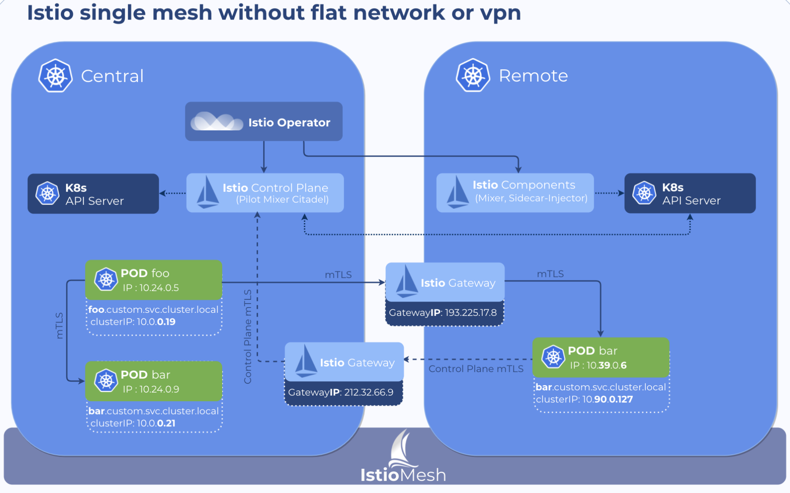
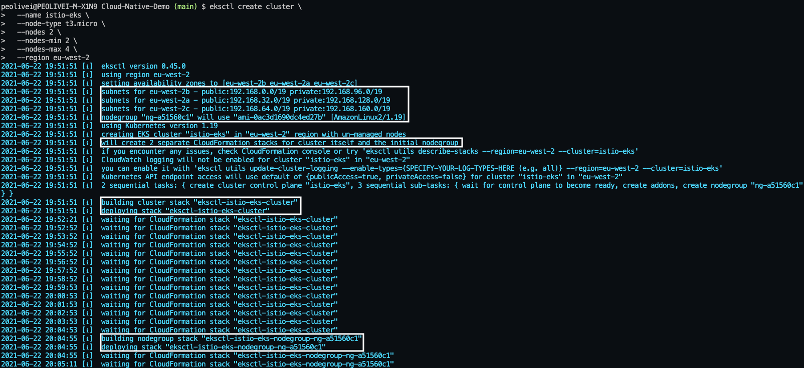
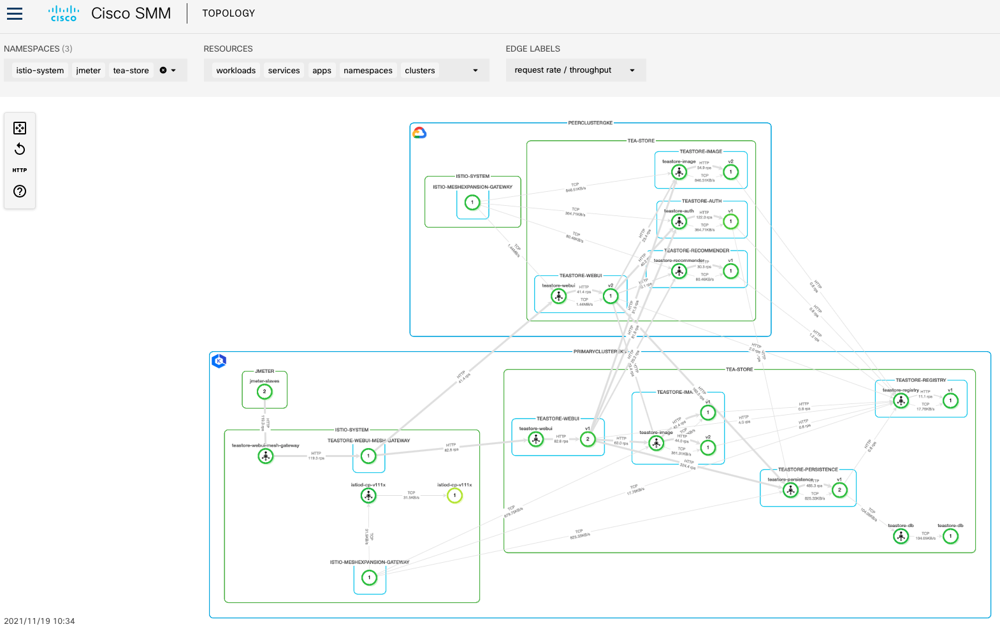
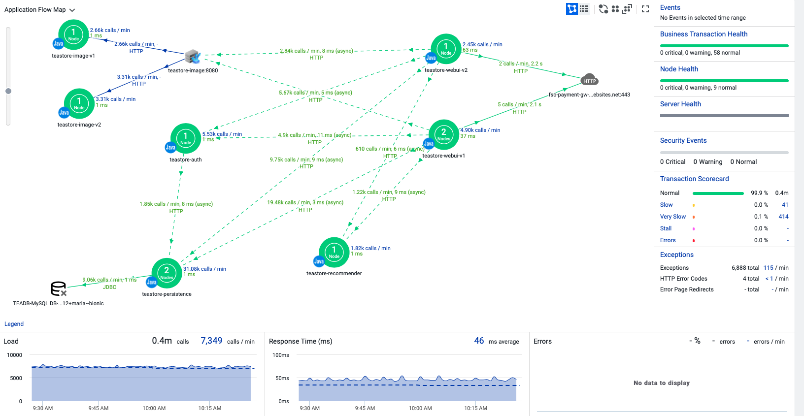
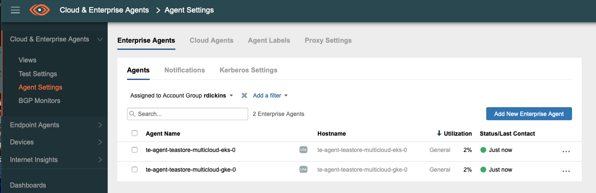
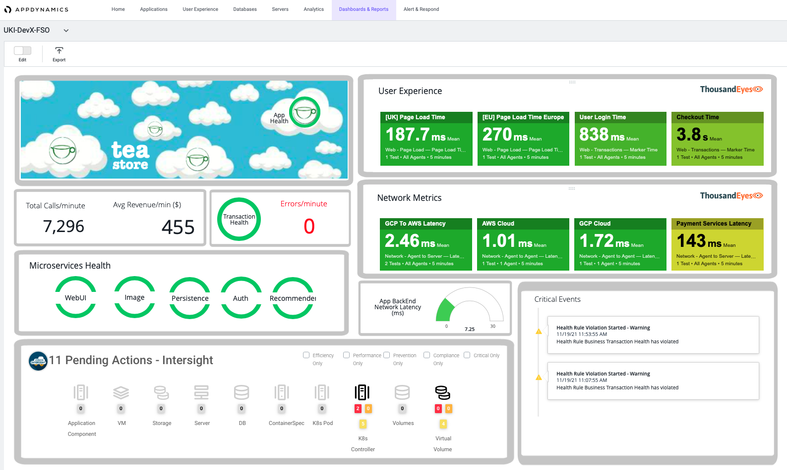

# Multi Cloud Deployment

Let's look at deploying the [TeaStore application by Descartes Research](https://github.com/DescartesResearch/TeaStore) across two different cloud providers, [AWS](https://aws.amazon.com) and [GCP](https://cloud.google.com/), in a **Multi-Cluster Single Mesh** style architecture.

But why go through such lengths, when in practice we should be keeping it simple by using as few clusters as possible? The immediate answer, from an _app dev_ mindset, is to separate the _non-production_ from the _production_ services, by placing them in different clusters. There are other reasons for joining the _multi-cluster, multi-cloud bandwagon_ and these are, not limited to, the following:
1. **Isolation**: Services' Control and Data plane separation (++`reliability` & ++`security`)
2. **Location**: Address `availability` and latency of critical services
3. **Scale**: `Scaling` services beyond the practical limits of a single cluster
4. **Compliance**:  Governance, `risk` management and compliance regulations

_Istio's_ _Split Horizon Endpoint Discovery Service (EDS)_ and _Server Name Indication (SNI) Based routing_ features allows a **Multi-Cluster Single Mesh** architecture without the need of a **flat network** or a **VPN** between the cluster (or the Clouds, if the clusters reside in different Clouds). This is achieved by enabling the Kubernetes control planes running a _remote Istio configuration_ to connect to a **single Istio control plane**. Once one, or more, Kubernetes clusters are connected to the (single) Istio control plane the _Envoy_ communicates with the Istio control plane in order to form a mesh network across those clusters. If you wish to know more, please check this **amazing** [blog post by BanzaiCloud](https://banzaicloud.com/blog/istio-multicluster-federation-2/). The picture below, from that amazing blog post, allows to better visualise the _Istio_ architecture in a hybrid and multi-cloud single mesh without flat network or VPN deployment.

[](./../docs/img/istio-multi-cloud-single-mesh.png)

For this multi-cloud and multi-cluster deployment we will be using **Cisco's Service Mesh Manager (SMM)** (previously [BanzaiCloud Backyards](https://banzaicloud.com/products/backyards/)). If you are following this demo you will need _SMM_ access, if you are part of _Cisco_ please reach out to [Roger Dickinson](rdickins@cisco.com), otherwise if you are new to _Service Mesh Manager_ and would like to evaluate it, [contact the SMM team](https://banzaicloud.com/products/try-backyards/) to discuss your needs and requirements, and organize a live demo. 

Alternatively, there is an open-source [_Istio Operator_](https://github.com/banzaicloud/istio-operator) developed by _BanzaiCloud_. If you wish to implement the service mesh this way then the _BanzaiCloud's_ [Istio Split Horizon EDS Multi Cluster Federation Example](https://github.com/banzaicloud/istio-operator/tree/release-1.10/docs/federation/gateway) is a great way to start! For further info, the amazing [blog post by BanzaiCloud](https://banzaicloud.com/blog/istio-multicluster-federation-2/) mentioned above is also super helpful.

## Setting up the Clouds

Since we will be deploying different clusters in different clouds, I would highly recommend that you use [kubectx](https://github.com/ahmetb/kubectx) to easily switch between clusters - `kubectx` will be widely used in this deployment. To install on a _macOS_, with `homebrew`, simply:

```bash
brew install kubectx
```

If you need to install on another _OS_, please check the [installation guide](https://github.com/ahmetb/kubectx#installation).

### GCP - GKE 

If you followed the single cluster deployment above you should already have the Google [Cloud SDK](https://cloud.google.com/sdk/install) installed, with the `gcloud` command-line tool and `kubectl` ready to go. **If not**, please install those and follow the [guide above](https://github.com/JPedro2/Cloud-Native-Demo#quick-start-with-gke-and-istio), **up to point 3. only**.


1. Create a cluster, called `smm-gke`, in _GKE_ with 4 nodes: 
    ```sh
    gcloud container clusters create smm-gke \
        --project=${PROJECT_ID} --zone=europe-west2-a --node-locations=europe-west2-a \
        --enable-autoupgrade --enable-autoscaling \
        --num-nodes=4 --min-nodes=4 --max-nodes=6 --machine-type=e2-standard-2
    ```
**Please Note:** This cluster gets deployed in London, zone `europe-west2-a`, if you wish to deploy elsewhere, please check the [available regions and zones here](https://cloud.google.com/compute/docs/regions-zones#available). Similarly, if you wish to change the `machine-type` [please check here](https://cloud.google.com/compute/docs/machine-types#general_purpose).

2. Rename the `kubectl` context with `kubectx`:
   ```sh
   $ kubectx
   gke_cleur-sad-dev-rmke_europe-west2_smm-gke
   ```
   ```sh
   kubectx smm-gke=gke_cleur-sad-dev-rmke_europe-west2_smm-gke
   ```

If you ever need to rezise this cluster you can do it with the following command.
```
gcloud container clusters resize smm-gke --num-nodes=4
```

### AWS - EKS

In order to create a cluster on [AWS EKS](https://aws.amazon.com/eks/?whats-new-cards.sort-by=item.additionalFields.postDateTime&whats-new-cards.sort-order=desc&eks-blogs.sort-by=item.additionalFields.createdDate&eks-blogs.sort-order=desc) you will need to:

1. [Create an AWS Account](https://aws.amazon.com/free/?all-free-tier.sort-by=item.additionalFields.SortRank&all-free-tier.sort-order=asc&awsf.Free%20Tier%20Types=*all&awsf.Free%20Tier%20Categories=*all)
   
2. Install the [AWS CLI v2](https://docs.aws.amazon.com/cli/latest/userguide/install-cliv2.html)
   
3. [Configure AWS CLI](https://docs.aws.amazon.com/cli/latest/userguide/cli-configure-quickstart.html) with your `Access Key ID`, `Secret Access Key`, `aws region` and `output format`.
   The good news is, you don't need to know _AWS_ to create the cluster as we will be using an amazing open-source tool called [eksctl](https://eksctl.io).
  `eksctl` is a simple CLI tool for creating clusters on _EKS_, so easy that you can create a cluster in minutes with just one command. Using CloudFormation, `eksctl` abstracts the heavy lifting from you in having to create _VPCs_, _IAM Roles_ and _Security Groups_ on _AWS_.

4. [Install eksctl](https://github.com/weaveworks/eksctl#installation)
   
5. Create a cluster called `smm-eks`, in _EKS_ with 2 nodes:
   ```sh
   eksctl create cluster \
      --name smm-eks \
      --node-type m5.large \
      --nodes 8 \
      --nodes-min 2 \
      --nodes-max 10 \
      --region eu-west-2
  ```

  **Please Note:** Similarly to _GKE_ above, this cluster gets deployed in London, zone `eu-west-2`, if you wish to deploy elsewhere, please check the [available regions and zones here](https://docs.aws.amazon.com/AWSEC2/latest/UserGuide/using-regions-availability-zones.html#concepts-available-regions). If you wish to change the `node-type` you can find more [information here](https://aws.amazon.com/ec2/instance-types/).

  Once you run the `eksctl` command, it does take a while to create the cluster, considerably longer when compared with _GKE_, so just hang in there. You will see the following on your terminal as the cluster gets created - you can spot some of the `eksctl` _CloudFormation_ magic.

  [](./../docs/img/eksctl-create-cluster.png)

6. Rename the `kubectl` context with `kubectx`:
   ```sh
   $ kubectx
   smm-gke
   peolivei@cisco.com@smm-eks.eu-west-2.eksctl.io
   ```
   ```sh
   kubectx smm-eks=peolivei@cisco.com@smm-eks.eu-west-2.eksctl.io
   ```
  You can confirm with `kubectx` that the context name has updated and that you now have both `smm-gke` and `smm-eks` contexts set.
  ```sh
  $ kubectx
  smm-eks
  smm-gke
  ```

If you ever need to resize this cluster, you will need to find the `nodegroup` name first:
```
eksctl get nodegroup --cluster=smm-eks
```

Then you can resize it and if you need to increase the maximum number of nodes, you can use the `-M` flag as well. The example below increases the number of nodes on the _EKS_ cluster to 10, as well as increasing the maximum number of nodes to 12.
```
eksctl scale nodegroup --name=<node-group-name> --cluster=smm-eks --nodes=10 -M=12
```

## Building a multi-cluster multi-cloud single mesh with Cisco Service Mesh Manager (SMM)

All of the instructions layed out here are based on the [SMM Documentation](https://smm-docs.eticloud.io/docs), so please check it out for further information. 

### Pre-Reqs

1. You will need [access to the _SMM_ binaries](https://smm-docs.eticloud.io/docs/installation/prerequisites/accessing-binaries/) in order to install this. Please check that you do.
   ```
   AWS_REGION=us-east-2 aws ecr list-images --registry-id 033498657557 --repository-name banzaicloud/istio-proxyv2 
   ```
   If you don't and you are _Cisco_ internal then you can request it, otherwise if you are new to _Service Mesh Manager_ and would like to evaluate it, [contact the SMM team](https://banzaicloud.com/products/try-backyards/) to discuss your needs and requirements, and organize a live demo.

2. Download the _SMM_ tool (v1.8.0 was the latest version at the time of writing) to the current directory
   ```
   aws s3 cp s3://cisco-eti-banzai-binaries/smm-cli/1.8.0/dist/smm_1.8.0_darwin_amd64.tar.gz ./
   ```

3. Install the _SMM_ tool and add it to `$PATH`
   ```
   tar -xvzf smm_1.8.0_darwin_amd64.tar.gz
   mkdir bin
   mv smm bin/
   export PATH=$PWD/bin:$PATH
   smm -h
   ```
   **Please Note:** If you close your terminal you will need to add the _SMM_ tool to your `$PATH` again!

### Installation

1. Install _SMM_ on the primary cluster (_EKS_) using a `cluster-name` flag to make sure there are no naming issues with weird characters, like `_-/.\`
   ```
   kubectx smm-eks
   smm install -a --cluster-name primaryclustereks
   ```
   This might take a while and it will be finished once you get all the green ticks.

2. Grab the `kubeconfig` of the peer cluster (_GKE_)
   ```
   cp ~/.kube/config ~/.kube/config_backup
   rm ~/.kube/config
   gcloud container clusters get-credentials smm-gke
   mv ~/.kube/config .
   mv ~/.kube/config_backup ~/.kube/config
   mv config gke-peer-kubeconfig
   ```

3. Attach the peer cluster (_GKE_) to the service mesh
   ```
   smm istio cluster attach gke-peer-kubeconfig --name=peerclustergke
   ```

4. Wait until the peer cluster is attached. Attaching the peer cluster takes some time. 
   ```
   smm istio cluster status
   ```
   The process is finished when you see `Available` in the `Status` field of both clusters.
   
5. You can view the `IstioControlPlane` resource, the `IstioMeshGateway`, as well as the `pods` and `services` created by _SMM_
   ```
   kubectl get icp -n istio-system
   kubectl get IstioMeshGateway -n istio-system
   kubectl get svc -n istio-system
   kubectl get pods -n smm-system
   ```

6. Open the _SMM_ Dashboard and look around! For now there isn't an application deployed yet, but once there is, the `Topology` section is quite the mind blow.
   ```
   smm dashboard
   ```

### Unninstall SMM completely

1. Detach the peer cluster - this is very important, do not proceed to the next step without completing this one!
   ```
   smm istio cluster detach gke-peer-kubeconfig
   ```
2. Unninstall all _SMM_ components using the _SMM_ tool
   ```
   smm uninstall -a
   ```
3. Delete remaining CRDs
   ```
   kubectx smm-eks
   kubectl get crd |grep -i -e istio.banzaicloud.io -e sre -e backyards -e istio.io -e cisco.com -e banzaicloud.io -e cert-manager|cut -d ' ' -f 1 |xargs kubectl delete crd

   kubectx smm-gke
   kubectl get crd |grep -i -e istio.banzaicloud.io -e sre -e backyards -e istio.io -e cisco.com -e banzaicloud.io -e cert-manager|cut -d ' ' -f 1 |xargs kubectl delete crd
   ```
4. Delete remaining Mutating and Validating Webhooks
   ```
   kubectx smm-eks
   kubectl get mutatingwebhookconfiguration |grep -i -e istio|cut -d ' ' -f 1 |xargs kubectl delete mutatingwebhookconfiguration
   kubectl get validatingwebhookconfiguration |grep -i -e istio|cut -d ' ' -f 1 |xargs kubectl delete validatingwebhookconfiguration

   kubectx smm-gke
   kubectl get mutatingwebhookconfiguration |grep -i -e istio|cut -d ' ' -f 1 |xargs kubectl delete mutatingwebhookconfiguration
   kubectl get validatingwebhookconfiguration |grep -i -e istio|cut -d ' ' -f 1 |xargs kubectl delete validatingwebhookconfiguration
   ```

## Instrument the clusters and the application with AppDynamics

Before deploying the application, I highly recommend that you deploy the [AppDynamics Cluster Agent](https://docs.appdynamics.com/21.1/en/infrastructure-visibility/monitor-kubernetes-with-the-cluster-agent) which collects metrics and metadata for the entire cluster, including every node and namespace down to the container level. Since the all of the _TeaStore_ app microservices are written in _JAVA_ we can also _Auto-Instrument_ these with _AppDynamics APM Java Agents_ [using the cluster agent](https://docs.appdynamics.com/21.1/en/infrastructure-visibility/monitor-kubernetes-with-the-cluster-agent/auto-instrument-applications-with-the-cluster-agent).
**Please Note:** Since we have two clusters we will need to install a cluster agent on each and this installation requires [Helm](https://helm.sh/docs/intro/install/). For more info, [please check the documentation](https://docs.appdynamics.com/21.1/en/infrastructure-visibility/monitor-kubernetes-with-the-cluster-agent/install-the-cluster-agent/install-the-cluster-agent-with-helm-charts).

1. Let's start with the primary cluster. Create the `appdynamics` namespace
   ```
   kubectx smm-eks
   kubectl create ns appdynamics
   ```
2. Add your _AppDynamics_ controller credentials to the values file `values-ca.yaml.tpl`, between _lines 1-6_  under [multiCloudDeployments/control/AppDynamics folder](./multiCloudDeployments/control/AppDynamics). Save it and rename it as `values-ca.yaml`
3. Add the cluster agent chart repository to _Helm_
   ```
   helm repo add appdynamics-charts https://appdynamics.github.io/appdynamics-charts
   ```
4. Deploy the cluster agent on the `appdynamics` namespace
   ```
   helm install -f multiCloudDeployments/control/AppDynamics/values-ca.yaml cluster-agent appdynamics-charts/cluster-agent -n appdynamics
   ```
   This will deploy the cluster agent with **auto-intrumentation ON**. If you check your `values-ca.yaml` file between _lines 9-27_, you can inspect the _auto-instrumentation_ configuration.

5. Check that the cluster agent is running
   ```
   kubectl get pods -n appdynamics
   ```
   Once this is running it takes about 15/20mins for all the data to be populated on your AppDynamics Controller Dashboard and you can view it under `Servers` > `Clusters`.

6. Deploy the same thing on the peer cluster. Similarly as before, add your _AppDynamics_ controller credentials to the values file `values-ca.yaml.tpl`, between _lines 1-6_  under [multiCloudDeployments/peer/AppDynamics folder](./multiCloudDeployments/peer/AppDynamics)
   ```
   kubectx smm-gke
   kubectl create ns appdynamics
   helm repo add appdynamics-charts https://appdynamics.github.io/appdynamics-charts
   helm install -f multiCloudDeployments/peer/AppDynamics/values-ca.yaml cluster-agent appdynamics-charts/cluster-agent -n appdynamics
   kubectl get pods -n appdynamics
   ```

If you ever need to change the _AppDynamics_ cluster agent configuration you can edit the `values-ca.yaml` files and then use _helm_ to upgrade the deployment. Below is an example on how you would upgrade the _AppDynamics_ cluster agent on the primary cluster, after you edit and save the `values-ca.yaml` under the [multiCloudDeployments/control/AppDynamics folder](./multiCloudDeployments/control/AppDynamics).

```
kubectx smm-eks
helm upgrade -f multiCloudDeployments/control/AppDynamics/values-ca.yaml cluster-agent appdynamics-charts/cluster-agent -n appdynamics
```

## Install the TeaStore application

To test and use our multi-cloud extended service mesh that we just deployed with _Cisco SMM_ we will be using TeaStore. We will deploy different components of the application in each cluster.

### Primary Cluster Deployment

In this cluster we will be installing the following microservices:
* DB
* Registry
* Persistence
* WebUI v1
* Image v1
* Image v2

1. Create a `tea-store` namespace
   ```
   kubectx smm-eks
   kubectl create tea-store
   ```

2. Apply _SMM side-car proxy auto-injection_ to the `tea-store` namespace
   ```
   smm sp ai on --namespace=tea-store
   ```
   **Please Note** The _SMM side-car proxy auto-injection_ just needs to be activated once via the _SMM tool_. This is propagated throughout the mesh on both clusters.

3. Deploy all the _TeaStore_ microservices mentioned above
   ```
   kubectl apply -f multiCloudDeployments/control/Tea-Store/deployments.yaml -n tea-store
   ```

4. Deploy all the _TeaStore_ microservices services. **Please Note** that for service discover purposes all services need to be deployed on both clusters
   ```
   kubectl apply -f multiCloudDeployments/control/Tea-Store/services.yaml -n tea-store
   ```

5. Check that all pods are running. If you describe one of the pods you will see that the _AppDynamics JAVA agent_ was installed via an _init container_ and that the `istio-proxy` container is attached.
   ```
   kubectl get pods -n tea-store
   kubectl describe pods <pod-name> tea-store
   ```

As part of our deployment we will be leveraging _K8s horizontal pod autoscaling (hpa)_. The idea being that as user traffic increases, _k8s_ will increase the number of replicas of particular pods. In this case we will target `teastore-webui` and `teastore-persistence` and will increase the number of replicas up to `3` and `2`, respectively, if the `%CPU` of the pods go above 95%

```
kubectl autoscale deployment teastore-webui --cpu-percent=95 --min=1 --max=3 -n tea-store
kubectl autoscale deployment teastore-persistence --cpu-percent=95 --min=1 --max=2 -n tea-store
```

You can then check the status of the _hpa_. This will be useful once we add the load generator in the upcoming sections.
```
kubectl get hpa -n tea-store
```

### Peer Cluster Deployment

In this cluster we will be installing the following microservices:
* Auth
* Recommender
* WebUI v2
* Image v2

1. Create a `tea-store` namespace
   ```
   kubectx smm-gke
   kubectl create tea-store
   ```

2. Deploy all the _TeaStore_ microservices mentioned above
   ```
   kubectl apply -f multiCloudDeployments/peer/Tea-Store/deployments.yaml -n tea-store
   ```

3. Deploy all the _TeaStore_ microservices services. **Please Note** that for service discover purposes all services need to be deployed on both clusters
   ```
   kubectl apply -f multiCloudDeployments/peer/Tea-Store/services.yaml -n tea-store
   ```

4. Check that all pods are running
   ```
   kubectl get pods -n tea-store
   ```

### Set up the multi-cloud extended service mesh for the TeaStore app

The application is now deployed and instrumented but so far there is no ingress defined so it is not exposed yet. For that we need to create an `IstioMeshGateway`, as well as a `Gateway`. For more information on how _Istio ingress and egress gateways_ work and why would you need both a _IstioMeshGateway_ and a _Gateway_, I would highly recommend reading [this blog post](https://banzaicloud.com/blog/istio-multiple-gateways/).
Both these resources will be defined on the primary cluster, so the ingress for the application will effectively be deployed on _EKS_.

1. Deploy the `IstioMeshGateway` and `Gateway` for the TeaStore app
   ```
   kubectx smm-eks
   kubectl apply -f multiCloudDeployments/control/Tea-Store/istio/webui-mesh-gw.yaml
   ```
2. Deploy the _istio_ ingress rule for the TeaStore app
   ```
   kubectl apply -f multiCloudDeployments/control/Tea-Store/istio/webui-ingress.yaml
   ```
3. Define egress rules. This will mainly allow you to see the outbound calls to the _AppDynamics_ controller on the _SMM_ dashboard
   ```
   kubectl apply -f multiCloudDeployments/control/Tea-Store/istio/egress-rules.yaml
   ```
4. Get the `External-IP` of the `teastore-webui-mesh-gateway`
   ```
   kubectl get svc -n istio-system
   ```
   You can now access the TeaStore App!! 🥳🥳🥳
5. (Optional) Have a look at the `IstioMeshGateway` and `Gateway` resources deployed
   ```
   kubectl get IstioMeshGateway -n istio-system
   kubectl get Gateway -A
   ```

Now, the application doesn't have much load, unless you start spamming it! Let's add a load generator so that you can start visualizing some cool stuff on both _SMM_ and _AppDynamics_.

## Install JMeter load generator for TeaStore

### Pre-Reqs
For stressing the TeaStore there is a Browse Profile template, `tea-store-test.jmx` under the [multiCloudDeployments/control/Tea-Store/jmeter-loadgenerator folder](./multiCloudDeployments/control/Tea-Store/jmeter-loadgenerator), that is used by the JMeter Load generator.
1. Provide the `hostname` of where your TeaStore application is hosted and how many users you want to simulate the load
    1.1. (Line 13) Replace with your TeaStore `hostname`. This could be internal within service mesh (ingress mesh gateway) or the external address.
    1.2. (Line 23) Modify the number of users, if needed
    1.3. **Save the file!**

2. Create `jmeter` namespace and apply `SMM` _sidecar-proxy auto injection_ to it
   ```
   kubectx smm-eks
   kubectl create ns jmeter
   smm sp ai on --namespace=jmeter
   ```

### Instal JMeter

1. Make the script executable and launch `jmeter_cluster.sh` to start the deployment
   ```
   chmod +x multiCloudDeployments/control/Tea-Store/jmeter-loadgenerator/jmeter_cluster_create.sh
   ./multiCloudDeployments/control/Tea-Store/jmeter-loadgenerator/jmeter_cluster_create.sh
   ```

2. After the test starts, you will see summary logs from the JMeter master pod
    2.1 Let it run for a while to make sure there are no errors
    2.2 Check the _AppDynamics_ TeaStore Application Dashboard and make sure you can see the load
    2.3 The _loadgenerator_ is now running successfully and you can exit the pod by pressing `CTRL+C`

### Modify and/or Stop
_Please note_ that the default option is that the thread group loops forever.
If you wish to stop the test and/or modify the load (by modifying the number of users), you  will need to delete all the resources within the the `jmeter` namespace - **do not delete the namespace**. For that you can use the `jmeter_cluster_stop.sh` script.
1. Make the script executable and launch `jmeter_cluster_stop.sh` to stop the deployment and delete all the resources
   ```
   chmod +x multiCloudDeployments/control/Tea-Store/jmeter-loadgenerator/jmeter_cluster_stop.sh
   ./multiCloudDeployments/control/Tea-Store/jmeter-loadgenerator/jmeter_cluster_stop.sh
   ```
2. Modify `tea-store-test.jmx` on lines 13 and/or 23, if needed. **Save it!**
3. Relaunch the jmeter start-up script
   ```
   ./multiCloudDeployments/control/Tea-Store/jmeter-loadgenerator/jmeter_cluster_create.sh
   ```

## Visualise the TeaStore app with SMM and AppDynamics

Now that the application has an ingress and there is a load generator creating traffic, you can visualise the application topology at a service mesh level with _SMM_ and at the application level with _AppDynamics_

1. Deploy the _SMM_ dashboard
   ```
   smm dashboard
   ```
   Make sure that you select the `tea-store`, `jmeter` and `istio-system` namespaces from the drop-down menu.

   [](./../docs/img/tea-store-smm-dashboard.png)


2. Check the _AppDynamics_ Application dashboard
   
   [](./../docs/img/tea-store-appd-dashboard.png)


Since you now have those tools available, go ahead and play with _istio_ routing. There are a few manifests already under the [multiCloudDeployments/control/Tea-Store/istio/routing folder](./multiCloudDeployments/control/Tea-Store/istio/routing). If you want to play with weighted traffic between versioned deployments (like `webui` and `image` `v1` and `v2`) you will need to apply the `DestinationRule` resource.

Below is an example of how you can deploy an injection delay of 3s on 80% of `image v1`'s traffic.
```
kubectx smm-eks
kubectl apply -f multiCloudDeployments/control/Tea-Store/istio/routing/0-destinationRules.yaml -n tea-store
kubectl apply -f multiCloudDeployments/control/Tea-Store/istio/routing/3-injection-delay-image-v1.yaml -n tea-store
```

Go ahead and inspect both _SMM_ and _AppDynamics_ dashboards. 

To eliminate the 3s delay just delete the `teastore-image-injection-delay` virtualservice and the TeaStore app behaviour will go back to normal
```
kubectl delete virtualservice teastore-image-injection-delay -n tea-store
```

## ThousandEyes

### ThousandEyes Kubernetes Enterprise Agent
This demo includes a [ThousandEyes enterprise agent](https://www.thousandeyes.com/product/enterprise-agents) that is deployed as a `StatefulSet`. It also uses a persistent volume to preserve agent status across cluster re-deployments. This agent gives you _inside-out_ visibility within the cluster, as well as the possibility of having network tests between the two clouds to track latency and any other issues that may occur. 

To deploy the enterprise agent you will need to get your `TE Agent Account Token`, which you can get by [following this guide](https://docs.thousandeyes.com/product-documentation/global-vantage-points/enterprise-agents/installing/where-can-i-get-the-account-group-token#agent-settings-page).

Once you have your `TE Agent Account Token` add it to _line 60_ on `te-agent.yaml.tpl` file on both [multiCloudDeployments/control/ThousandEyes](./multiCloudDeployments/control/ThousandEyes) and [multiCloudDeployments/peer/ThousandEyes](./multiCloudDeployments/peer/ThousandEyes) folders. Save and rename the file as `te-agent.yaml`, on both folders!

The enterprise agent must be deployed to a fixed _K8s_ node to ensure that the agent's identity persists across pod re-deployments. This requires labeling the _k8s_ node that ThousandEyes agent will be deployed to.

1. Label one of the nodes
   ```
   kubectx smm-eks 
   kubectl get nodes
   kubectl label nodes <node-name> tehost=host2
   ```
   To check that the node has been labelled
   ```
   kubectl get nodes -L tehost
   ```
   If you wish to delete it
   ```
   kubectl label node <node-name> tehost-
   ```

2. Create a `thousandeyes` namespace
   ```
   kubectl create ns thousandeyes
   ```

3. Deploy the enterprise agent on the `thousandeyes` namespace
   ```
   kubectl apply -f multiCloudDeployments/control/ThousandEyes/te-agent.yaml -n thousandeyes
   ```

4. Check that the agent is sucessfully running
   ```
   kubectl get pods -n thousandeyes
   ```
   
   If you want to check the logs of the enterprise agent you can use the following command:
   ```
   kubectl -n thousandeyes exec -it te-agent-teastore-multicloud-eks-0 -- cat /var/log/agent/te-agent.log
   ```
5. Deploy the same enterprise agent but now on the peer cluster - you will still need to label a node!
   ```
   kubectx smm-gke
   kubectl get nodes
   kubectl label nodes <node-name> tehost=host2
   kubectl create ns thousandeyes
   kubectl apply -f multiCloudDeployments/peer/ThousandEyes/te-agent.yaml -n thousandeyes
   kubectl get pods -n thousandeyes
   ```

Once both agents are running on both clusters you should see them come online in the ThousandEyes Dashboard, as follows.

[](./../docs/img/te-ent-agents.jpg)

You can now create tests using those agents!

### ThousandEyes Transaction tests

You can use [ThousandEyes Cloud agents](https://www.thousandeyes.com/product/cloud-agents), deployed worldwide, to perform [synthetic transaction tests](https://www.thousandeyes.com/blog/application-monitoring-new-synthetic-transaction-tests/) against the TeaStore application. On the [multiCloudDeployments/control/ThousandEyes/TransactionTests folder](./multiCloudDeployments/control/ThousandEyes/TransactionTests) there is a sample transaction test example, `Browse&Buy.js`, that you can import and use as your transaction test. 
As the name of the file suggests this transaction test browses through the app, adds a few items to the cart, logs in and checks out. There are a few markers and screenshots added to the test too, so you will be able to visualize these on your _ThousandEyes_ dashboard, as part of your test.

**Please Note:** If you are using the `Browse&Buy.js` transaction test you **need** to set the `Device Emulation` as `Desktop Small` under `Advanced Settings.`  

### ThousandEyes and AppDynamics Integrations

#### Native Alerts 
_ThousandEyes_ natively supports sending alert notifications directly to _AppDynamics_. This allows you to correlate trigger events with clear events, and to create policies in _AppDynamics_ based on specific properties like: _alertState_, _alertType_ (HTTP, Network, Voice, etc) and _testName_. In _AppDynamics_, _ThousandEyes_ alerts show up as custom events of type `ThousandEyesAlert` and allow you to open the _ThousandEyes_ app at the _Views_ screen for the alert start time to have further visibility into the issue.

You can quickly and easily set-up the native alerts integration by following the steps in the official [ThousandEyes Documentation](https://docs.thousandeyes.com/product-documentation/alerts/integrations/appdynamics-integration).

#### Embedding ThousandEyes Widgets on AppDynamics Dashboards
ThousandEyes dashboard widgets can be embedded directly into an AppDynamics dashboard.
To do this, simply use the _URL_ from the Embed Widget menu in a widget that is part of an existing ThousandEyes dashboard.

**Please Note:** Only the URL is needed, not the full iframe code.

Paste the URL into an AppDynamics dashboard iFrame widget, under the URL to display field in an AppDynamics widget. **Make sure Security Sandbox IFrame is unchecked.**

## Intersight Workload Optimizer (IWO)

If you wish to integrate _Cisco's_ [IWO](https://www.cisco.com/c/en/us/products/cloud-systems-management/intersight-workload-optimizer/index.html), a real-time decision engine for application resource management across on-premises and public cloud environments, please check the [iwo folder](./multiCloudDeployments/iwo). There you will find a guide that shows you how to integrate _IWO_ with the primary and peer clusters, as well as how to integrate it with _AppDynamics_ and _AWS_ billing.

## SecureCN

If you wish to experiment with _Cisco's_ [SecureCN](https://securecn.cisco.com/login), a cloud native application security solution, you can request a free trial or talk to the SecureCN team for a deeper dive. Once you have access to the platform, if you wish to deploy _SecureCN_ integrated with _SMM_, please follow the guide on the [SecureCN folder](./multiCloudDeployments/SecureCN)

## Full Stack Observability Dashboard - AppDynamics Dashboard with IWO and Thousandeyes Integration

[](./../docs/img/fso-dashboard.jpg)
