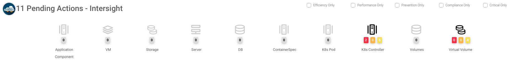

# Intersight Workload Optimizer

## Install IWO K8s Collector

To add _IWO_ to this multicloud demo you will need to deploy the _IWO K8s Collector_ to both clusters separately and claim them on your _Intersight_ account. The best way to do this is to follow the documentation that takes you through both of these scenarios very thoroughly.

1. [Download the latest IWO Collector](https://software.cisco.com/download/home/286319499/type/286328874/release/1.0.1) and unzip it in this folder
2. Go to [Intersight Help Center](https://intersight.com/help/saas/resources#cisco_intersight_handbook)
   2.1. Go to the _Cisco Intersight Workload Optimizer_ section and open the _Cisco Intersight Workload Optimizer Target Configuration Guide_
   2.2. Jump straight in to the _Cloud Native Targets_ section and follow all the steps. You will need to install the _IWO K8s Collector_ first and only then claim your targets.

## Add AppDynamics APM data to IWO

1. Go to [Intersight Help Center](https://intersight.com/help/saas/resources#cisco_intersight_handbook)
   1.1. Go to the _Cisco Intersight Workload Optimizer_ section and open the _Cisco Intersight Workload Optimizer Target Configuration Guide_
   1.2. Jump straight in to the _Application Performance Management (APM)_ > _Cisco AppDynamics_ section
   1.3. The targets are SaaS based so you will need to **Turn OFF Connect through an Intersight Assist**
   1.4. If you are using the `ukse` _AppDynamics_ org then there is an account already created for this purpose `uki-devx-iwo` - please use this and you can ignore the _Prerequisites_ section. If not, then please follow the _Prerequisites_ section closely.
   1.5. Follow the instructions in the _Claiming an AppDynamics Target_ section and **please note** that you are **NOT** using _Intersight Assist_

## AWS Billing Capabilities to IWO

At the time of writing only AWS billing is supported

1. Go to [Intersight Help Center](https://intersight.com/help/saas/resources#cisco_intersight_handbook)
   1.1. Go to the _Cisco Intersight Workload Optimizer_ section and open the _Cisco Intersight Workload Optimizer Target Configuration Guide_
   1.2. Jump straight in to the _Cloud Targets_ > _AWS Billing Targets_ section
   1.3. If you are using the _AWS UKI-DevX_ account then the _S3 bucket_ is already created for you on that account - `aws-cur-iwo`. If not, then please follow the instructions on how to create the required _S3 bucket_ under your _AWS_ account

## Add IWO Widget to AppDynamics Dashboard

The following instructions are heavily based on this [blog post](http://www.borisaelen.nl/blog/integrating-iwo-and-appd/), with the main difference being that the _IWO_ widget is now updated to accommodate for _K8s_ resources.

It is possible to add a widget to your _AppDynamics_ Dashboard that provides insight into _IWO_.
This widget will show all actions for the TeaStore appl sorted by Application Components, VMs, Storage, Servers, DB, ContainerSpec, K8s Pods, K8s Controller, Volumes, Virtual Volumes.  
It is also possible to zoom in on those actions or execute them straight from _AppDynamics_.

[](./../../../docs/img/iwo-appd-widget.png)

### Create an EC2 instance to run the Widget on
The widget needs to be publicly available so that you can import it to your _AppDynamics_ Dashboard. In this instruction you will use an _Amazon Linux EC2_ instance to run the widget on.

1. Get the `AMI ID` of the latest _Linux_ Image
   ```
   AWS_AMI_ID=$(aws ec2 describe-images \
   --owners 'amazon' \
   --filters 'Name=name,Values=amzn2-ami-hvm-2.0.????????-x86_64-gp2' 'Name=state,Values=available' \
   --query 'sort_by(Images, &CreationDate)[-1].[ImageId]' \
   --output 'text')
   ```
2. Get your default `VPC ID`
   ```
   AWS_VPC_ID="$(aws ec2 describe-vpcs      \
   --filter "Name=isDefault, Values=true"   \
   --query "Vpcs[0].VpcId" --output text)"
   ```
3. Create a Security group in your VPC and open _port_ `22` and `3000`
   ```
   AWS_SG_ID=$(aws ec2 create-security-group --vpc-id $AWS_VPC_ID --group-name 'iwo-widget-sg' --description 'Security group for our IWO widget for AppD' --out text)
   aws ec2 authorize-security-group-ingress \
   --group-id $AWS_SG_ID \
   --ip-permissions '[{"IpProtocol": "tcp", "FromPort": 22, "ToPort": 22, "IpRanges": [{"CidrIp": "0.0.0.0/0", "Description": "Allow SSH"}]}]' &&
   aws ec2 authorize-security-group-ingress \
   --group-id $AWS_SG_ID \
   --ip-permissions '[{"IpProtocol": "tcp", "FromPort": 3000, "ToPort": 3000, "IpRanges": [{"CidrIp": "0.0.0.0/0", "Description": "Allow HTTPS"}]}]'
   ```
   **Please Note:** you are opening port 3000 so anyone that knows the correct URL and your _IWO_ `AppID` can now access your widget and execute the actions. !!! Do not use this in production !!!

4. Create an _EC2_ key pair, consisting of a public and a private key as a set of security credentials, [more info here](https://docs.aws.amazon.com/AWSEC2/latest/UserGuide/ec2-key-pairs.html)
   ```
   aws ec2 create-key-pair \
    --key-name iwo-widget \
    --query "KeyMaterial" \
    --output text > iwo-widget.pem
   
   chmod 400 iwo-widget.pem
   ```

5. Create an _EC2_ instance and tag it
   ```
   AWS_EC2_INSTANCE_ID=$(aws ec2 run-instances \
   --image-id $AWS_AMI_ID \
   --instance-type t2.micro \
   --key-name iwo-widget \
   --monitoring "Enabled=false" \
   --security-group-ids $AWS_SG_ID \
   --query 'Instances[0].InstanceId' \
   --output text)

   aws ec2 create-tags --resources $AWS_EC2_INSTANCE_ID --tags "Key=Name,Value=iwo-widget"
   ```

6. Get the public _DNS_ of the new instance
   ```
   AWS_EC2_INSTANCE_IP=$(aws ec2 describe-instances --instance-ids $AWS_EC2_INSTANCE_ID --out text --query 'Reservations[].Instances[].PublicDnsName')

   aws ec2 describe-instances --instance-ids $AWS_EC2_INSTANCE_ID --out text --query 'Reservations[].Instances[].[PublicDnsName, State.Name]'
   ```

7. _SSH_ to the instance using the key-pair `.pem` file created in above, to make sure it works. Then close the _SSH_ session before moving to the next section.
   ```
   ssh ec2-user@$AWS_EC2_INSTANCE_IP -i ./iwo-widget.pem
   ```

### Install the widget on the EC2 instance

1. Copy the widget folder over to the _EC2_ instance
   ```
   scp -r IWO-AppD-Widget-Integration ec2-user@$AWS_EC2_INSTANCE_IP:~/. -i ./iwo-widget.pem
   ```
2. _SSH_ to the instance
   ```
   ssh ec2-user@$AWS_EC2_INSTANCE_IP -i ./iwo-widget.pem
   ```
3. Install _nodejs_ on the instance
   ```
   sudo curl -sL https://rpm.nodesource.com/setup_15.x | sudo -E bash -
   sudo yum install -y nodejs
   ```
4. Provide the widget with a _API_ key and _Private_ key to access _Intersight_. If you don't have one yet, [have a look here on how to create it](https://intersight.com/apidocs/introduction/security/)
   ```
   cd IWO-AppD-Widget-Integration
   echo "<apikey>" > keys/iwo_public_key.txt 
   echo "<private key>" > keys/iwo_private_key.pem
   ```
5. Create certificates for the SSL webserver. Please make sure to use the public dns name as the server name
   ```
   openssl req -newkey rsa:2048 -new -nodes -x509 -days 3650 -keyout bin/key.pem -out bin/cert.pem
   ```
6. Make the widget app run as a deamon process with [PM2](https://pm2.keymetrics.io)
   ```
   sudo npm install pm2@latest -g
   pm2 start ./bin/www
   ```
7. Make the widget app persistent. _PM2_ can generate startup scripts and configure them in order to restore the app across expected or unexpected machine restarts
   ```
   pm2 startup
   ```
   Once you run this command _PM2_ will output a command for you to run - please run it.
   ```
   pm2 save
   ```

If you ever need to check the status of the widget app running or if you need to stop it, you can use the following commands.

```
pm2 show www

pm2 stop www
```

To get the `business app ID` from _IWO_ go to your `Intersight` > `Optimize` > `Overview` > Click on `TeaStore Business App Name` > Scroll Down to `Entity Information` and you will find the `ID` there.

Access the iwo-widget app on `https://<aws-ec2-ip>:3000/views/examples/cwom.html?businessAppID=<business-app-ID>`. You will have to accept the self signed certificate. 
You can now add this to an _AppDynamics_ dashboard as an `iFrame`. **Please note** that before doing this, you must accept the SSL certificate first, otherwise you wont be able to visualize it.